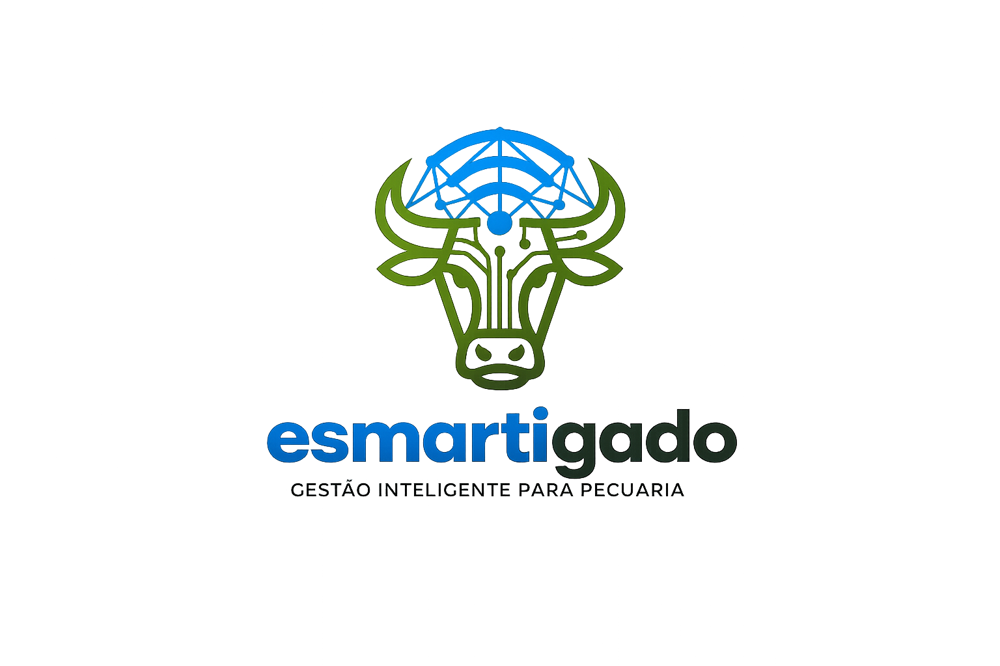
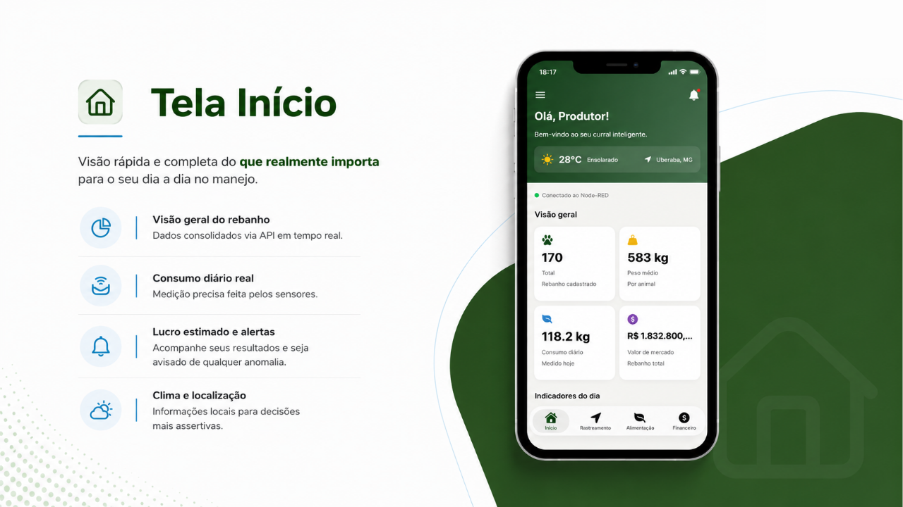
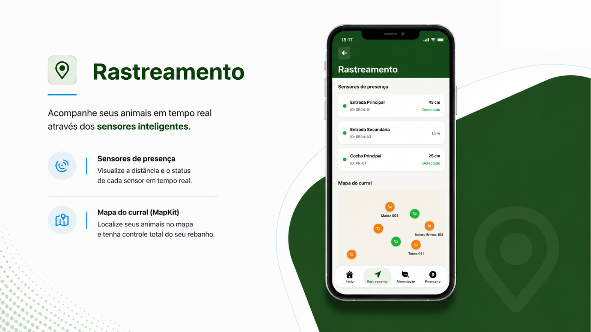
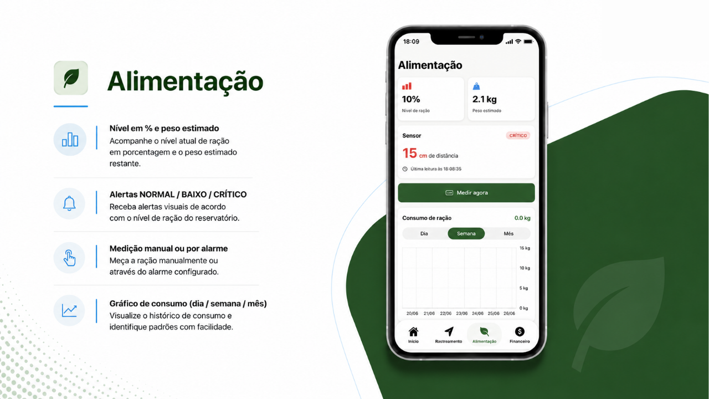
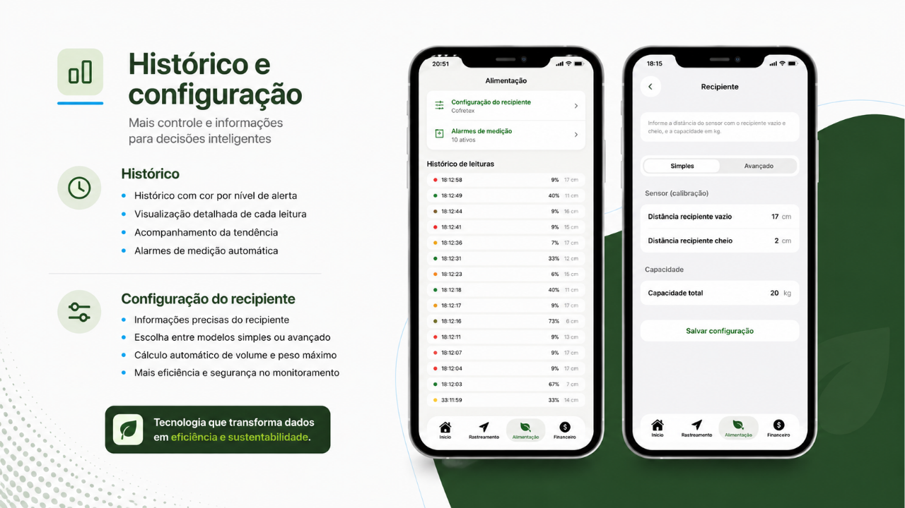

<div align="center">


<br/><br/>

<div align="center">

</div>

**Gestão inteligente de rebanho na palma da sua mão**

Sensores reais. Dados em tempo real. Decisões mais lucrativas.

</div>

---

## O problema que resolvemos

Criar gado ainda é uma atividade tocada muito no instinto. O produtor sabe quando a ração está acabando porque foi até o cocho olhar, percebe que um animal sumiu quando dá falta dele no fim do dia, e descobre o custo real da engorda só quando fecha a conta no fim do mês.

**O Esmartigado nasce dessa lacuna:** trazer para a palma da mão, em tempo quase real, o que está acontecendo dentro do curral — sem planilha, sem palpite, sem surpresa.

---

## Telas do Aplicativo

<table>
  <tr>
    <td align="center" width="50%">
      
      <br/><sub><b>Início — Visão Geral do Rebanho</b></sub>
    </td>
    <td align="center" width="50%">
      
      <br/><sub><b>Rastreamento — Mapa do Curral</b></sub>
    </td>
  </tr>
  <tr>
    <td align="center" width="50%">
      
      <br/><sub><b>Alimentação — Nível de Ração em Tempo Real</b></sub>
    </td>
    <td align="center" width="50%">
      
      <br/><sub><b>Histórico e Configuração do Recipiente</b></sub>
    </td>
  </tr>
  <tr>
    <td align="center" colspan="2">
      
      <br/><sub><b>Financeiro — Custos e Previsão de Consumo</b></sub>
    </td>
  </tr>
</table>

---

## Funcionalidades

### Início

- Visão consolidada do rebanho com dados via API em tempo real
- Temperatura e clima local integrados por localização
- Consumo diário medido pelos sensores
- Valor de mercado estimado do rebanho total
- Indicadores do dia em destaque

### Rastreamento

- Sensores de presença com status e distância em tempo real
- Mapa interativo do curral via MapKit com localização de cada animal ou lote
- Identificação de zonas monitoradas (Entrada Principal, Entrada Secundária, Cocho)

### Alimentação

- Nível de ração em porcentagem e quilos estimados
- Alertas visuais: **NORMAL / BAIXO / CRÍTICO**
- Medição manual ou por alarme configurável
- Gráfico de consumo por dia, semana e mês
- Previsão inteligente com regressão linear e sazonalidade semanal
- Proteção antifalsa leitura: a medição é segurada quando o sensor detecta animal no cocho

### Histórico e Configuração

- Histórico de leituras com código de cor por nível de alerta
- Configuração do recipiente em modo simples ou avançado
- Calibração do sensor: distância vazio/cheio e capacidade em kg
- Alarmes de medição automática configuráveis

### Financeiro

- Receita do mês com variação em relação ao período anterior
- Custos detalhados: Alimentação, Sanidade e Manutenção
- Custo de alimentação calculado a partir do consumo realmente medido
- Previsão da semana atual e da próxima
- Projeção dos próximos 7 dias com gráfico de barras

---

## Arquitetura

```
Esmartigado/
├── EsmartigadoApp.swift          # Ponto de entrada
├── ContentView.swift             # Navegação principal (TabView)
│
├── Views/
│   ├── HomeView.swift            # Tela inicial e dashboard
│   ├── TrackingView.swift        # Rastreamento e mapa
│   ├── FeedingView.swift         # Alimentação e gráficos
│   ├── RacaoConfigView.swift     # Configuração do recipiente
│   ├── AlarmesView.swift         # Alarmes de medição
│   ├── FinancialView.swift       # Financeiro e projeções
│   └── Components/
│       └── DashboardComponents.swift
│
├── Models/
│   ├── AnimalModels.swift        # Entidade Animal
│   ├── RacaoModels.swift         # Leituras e configuração de ração
│   ├── SensorModels.swift        # Dados dos sensores IoT
│   ├── PresencaModels.swift      # Presença detectada
│   └── DashboardModels.swift     # Dados agregados do dashboard
│
├── Services/
│   ├── IoTService.swift          # Estado global + polling a cada 10s
│   ├── AnimaisAPI.swift          # CRUD de animais
│   └── RacaoAPI.swift            # Leituras, histórico, alarmes
│
└── Theme/
    └── AppTheme.swift            # Paleta de cores e estilos
```

### Fluxo de dados

```
[Sensores ESP32/Arduino]
        |  WebSocket / HTTP
        v
   [Node-RED Flow]  ──── REST API ────>  [IoTService]
                                              |
                              polling 10s     |  @Published
                                              v
                                      [SwiftUI Views]
                                   HomeView / FeedingView
                                   TrackingView / FinancialView
```

---

## Stack Tecnológica

| Camada           | Tecnologia                                              |
| ---------------- | ------------------------------------------------------- |
| App iOS          | Swift 5.9 · SwiftUI · Swift Charts · MapKit             |
| Concorrência     | Combine + async/await                                   |
| Backend IoT      | Node-RED                                                |
| Hardware         | ESP32 / Arduino · Sensor ultrassônico HC-SR04           |
| Protocolo        | HTTP REST (rede local) · WebSocket (medições on-demand) |
| Requisito mínimo | iOS 17+                                                 |

---

## API Reference

Rotas expostas pelo Node-RED e consumidas pelo app:

| Método     | Rota                 | Descrição                                            |
| ---------- | -------------------- | ---------------------------------------------------- |
| `GET`      | `/getanimais`        | Lista o rebanho cadastrado                           |
| `POST`     | `/postanimais`       | Cadastra novo animal                                 |
| `PUT`      | `/animais/{id}`      | Atualiza dados de um animal                          |
| `DELETE`   | `/animais/{id}`      | Remove animal                                        |
| `GET`      | `/ultimo`            | Última leitura de ração                              |
| `GET`      | `/historico`         | Histórico de leituras                                |
| `POST`     | `/medir`             | Dispara medição manual                               |
| `GET/POST` | `/alarme`            | Consulta ou configura horários de medição automática |
| `GET/POST` | `/config-recipiente` | Calibração do recipiente                             |
| `GET`      | `/consumo?periodo=`  | Consumo por `dia`, `semana` ou `mes`                 |
| `GET`      | `/presenca`          | Estado atual dos sensores de presença                |

---

## Como Rodar o Projeto

### Pré-requisitos

- Xcode 15+ com iOS 17 SDK
- Node-RED rodando na mesma rede local
- Sensores ESP32/Arduino conectados (ou simulados via Node-RED)

### Passo a passo

**1. Clone o repositório**

```bash
git clone https://github.com/victor-kauan-coder/Esmartigado.git
cd Esmartigado
```

**2. Configure o endereço do Node-RED**

Abra `Esmartigado/Services/IoTService.swift` e ajuste o IP:

```swift
enum IoTConfig {
    static let baseURL = "http://SEU_IP_AQUI:1880"
}
```

**3. Importe o fluxo Node-RED**

No Node-RED, importe o arquivo `flowEsmartigado/flow_esmartigado.json` via **Menu → Import**.

**4. Rode o app**

Abra `Esmartigado.xcodeproj` no Xcode, selecione um simulador ou device na mesma rede e pressione `Cmd + R`.

> As chamadas são HTTP dentro da rede local. O `Info.plist` já está configurado para permitir conexões locais. Para uso externo à rede da propriedade, o próximo passo é adicionar HTTPS.

---

## Hardware — Sensor Ultrassônico

O sensor de ração usa um HC-SR04 conectado ao ESP32, com filtragem de mediana em 3 leituras para eliminar ruídos causados pela interferência do Wi-Fi:

```cpp
noInterrupts();
digitalWrite(trigPin, HIGH);
delayMicroseconds(10);
digitalWrite(trigPin, LOW);
long duracao = pulseIn(echoPin, HIGH, 30000);
interrupts();
```

O código completo dos dispositivos está em `nodeMCU/`.

---

## Roadmap

- [ ] Alertas push via APNs quando ração atinge nível crítico
- [ ] Recomendação automática de reposição baseada na previsão de consumo
- [ ] Projeção de custo por arroba
- [ ] Suporte a múltiplos currais e fazendas
- [ ] HTTPS para acesso remoto fora da rede local
- [ ] Dashboard web complementar

---

## Por que o Esmartigado pode virar produto

Pecuária é um mercado gigante e ainda pouco digitalizado fora das grandes fazendas. A maior parte das soluções de gestão mira o produtor grande, com brincos eletrônicos caros e integrações complexas.

O Esmartigado aposta no pequeno e médio produtor: hardware acessível, aplicativo direto, valor entregue já na primeira semana — sem exigir que ninguém vire especialista em tecnologia. A partir do consumo, da presença e do custo já capturados, o caminho natural é evoluir para alertas inteligentes, recomendação de reposição de ração e projeções de custo por arroba — que é onde mora o ganho real para quem vive da margem.

---

<div align="center">

Tecnologia que transforma dados em eficiência e sustentabilidade.

</div>

## Colaboradores

<div align="center">

<table>
  <tr>
    <td align="center" style="padding: 20px;">
      <a href="https://github.com/victor-kauan-coder">
        
        <br/><br/>
        <b>Victor Kauan</b>
        <br/>
        <sub>
          <a href="https://github.com/victor-kauan-coder">
            
          </a>
        </sub>
      </a>
    </td>
    <td align="center" style="padding: 20px;">
      <a href="https://github.com/annalwisa">
        
        <br/><br/>
        <b>Anna Lwisa</b>
        <br/>
        <sub>
          <a href="https://github.com/annalwisa">
            
          </a>
        </sub>
      </a>
    </td>
    <td align="center" style="padding: 20px;">
      <a href="https://github.com/VitorFichel">
        
        <br/><br/>
        <b>Vitor Fichel</b>
        <br/>
        <sub>
          <a href="https://github.com/VitorFichel">
            
          </a>
        </sub>
      </a>
    </td>
    <td align="center" style="padding: 20px;">
      <a href="https://github.com/Jamelao30">
        
        <br/><br/>
        <b>Jamelao30</b>
        <br/>
        <sub>
          <a href="https://github.com/Jamelao30">
            
          </a>
        </sub>
      </a>
    </td>
  </tr>
</table>

</div>
